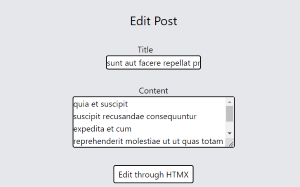

# Deno Fresh & Deno Fresh with HTMX

 

* [Description](#description)
* [Notes](#notes)
    + [NavBar](#navbar)
    + [Fetch posts with htmx](#fetch-posts-with-htmx)
    + [Fetch users with Fresh](#fetch-users-with-fresh)
    + [Create a new post with **hx-post**](#create-a-new-post-with---hx-post--)
    + [Create a new user with Fresh route handler](#create-a-new-user-with-fresh-route-handler)
    + [Delete post with htmx](#delete-post-with-htmx)
    + [Delete user with Fresh](#delete-user-with-fresh-with-fresh)
    + [Edit post with htmx](#edit-post-with-htmx)
    + [Edit user with Fresh](#edit-user-with-fresh)
* [Summary of observations](#summary-of-observations)

## Description

Study of HTMX usage vs. using Deno Fresh's native routing and handlers.

The app contains a **CRUD of posts** that explores htmx, and a **CRUD of users** which is handled through pure Fresh routing and handlers. 

JSON Placeholder api was used as mock db.


## Notes

### NavBar

Normally, the permanently visible navbar Component would appear in _app.tsx

```tsx 
   <body>
      <NavBar></NavBar>
        <Component />
    </body>
``` 
> __Problem:__
Htmx's hx-requests fetch **the whole page** and insert it into an existing page, so whatever stable parts that would be displayed on that page (e.g. navbar) will be repeated:


➡️ `<NavBar>` Component now appears on top of every single page that requires it. Not particularly smooth coding.

### Fetch posts with htmx

Fetches posts by calling a route in the app with htmx. The route contains a
function that fetches data from the api and returns it formatted in jsx (tsx).
Instead of re-directing user to that route, the returning jsx is inserted in a
specified section in the original page.

The button to fire the htmx is an **island** rendered client side, since it uses premade `<Button>` component.

### Fetch users with Fresh

Fetches users with Fresh's method by linking the user to a route where a Get
handler fetches the data from the api and passes them onto the component.

The buttons contain `<a>` tags to redirect the user and are **components**
rendered server-side.

Usercontrols (buttons) component needs to be repeated on top of the page that
displays the data, as the user actually moves to a new location.


### Create a new post with **hx-post**

Route *posts/add* displays a form to create a new post.
On submit, hx fires api/addPostQuery route which receives post request in handler and renders component with the returned data

*posts/add:* Click create post (hx-post)  
⬇️  
*api/addPostRequest:* Handler POST method  
⬇️  
*api/addPostRequest:* JSON Placeholder API  
⬇️  
*api/addPostRequest:* Render.ctx in handler with returned data  
⬇️  
*api/addPostRequest:* return component with data in jsx  
⬇️   
*posts/add:* Replace form with returned JSX 

### Create a new user with Fresh route handler

Route *users/add* displays a form to create a new user.
On submit, 
`<form method="post">` sends a post request to **this same page's handler**, where data is sent to JSON Placeholder API, received and rendered back to the component. 

*users/add:* Click create user  
⬇️  
*users/add:* Handler on same route handles POST method and sends data to API.  
⬇️  
*users/add:* Render.ctx in handler renders component with the returned data from API.  
⬇️  
*users/add:* When Api-returned data is present in the component, information about the new user is rendered instead of the form.

### Delete post with htmx

Observations:

❗Whatever hx fetches and inserts into the page **cannot contain** another component, as all styling disappears.

For each row of post data, the idea was to return a delete button that contains the id of the post. But it doesn't seem to be possible to return a component inside the jsx for htmx.

Attempted solution very convoluted: 
- Insert hx fetch to *api/deletePost/[id]* that inserts a confirmation message into the table.
- The confirmation message should be in another route, but a confirmation button needs to be an island, so bring a confirmation component that includes an island button that handles the request to delete the post from the api and redirects the post to the page that fetches the post list again.

**Not feasible!**

A simpler solution was implemented:

For each fetched post, The postQuery renders a table cell with its own hx-GET call to *api/deletePost/[id]*.
```jsx
  <td 
    hx-get={`/api/deletePost/${post.id}`}
    hx-target={`#row-${post.id}`}
    hx-swap="innerHTML">
    Delete
  </td>
  ```
  
 This route contains a GET-handler method that sends a delete request to JSON Placeholder, and on successful response renders a component with a message that the post was deleted, which is finally inserted into the postQuery view.

❗Downside: **No confirmation message before deletion.**

### Delete user with Fresh with Fresh

The delete button in the table row is actually a modal component.

The modal contains a confirmation to delete the user. Modal button is a handleClick function inside the component that sends a fetch to api/userQuery where DELETE method of the handler takes care of JSON placeholder api request.

On successful response from the API, the modal show a brief message about the user being deleted, and the redirects the user to `window.location.href = "/api/userQuery"`, which is the GET-request to the handler and refetches the user list to show updated content (only theoretically, as JSON placeholder db isn't actually altered)

SO:

Delete button  
⬇️   
Modal confirmation  
⬇️  
HandleClick  
⬇️  
*api/userQuery* DELETE handler method  
⬇️   
Modal success message  
⬇️  
*api/userQuery* GET handler method

### Edit post with htmx

Delete button takes user to *posts/edit/:id* where id is the post's id.  
⬇️   
GET handler fetches the post from JSON PH and inserts old data as the default values into a form, which user can then update.   
⬇️  
Submit fires hx-put request to *api/editPostQuery*. The necessary post id is included in a hidden input in the form and sent together with the rest of the data.
```ts
<input type="hidden" name="id" value={post.id} />
```
⬇️  
*api/editPostQuery* handler sends update request to API and, on success, returns component with the new data.  
⬇️     
Hx replaces the form with the new data.  
⬇️  
*api/userQuery* GET handler method



### Edit user with Fresh

Through **edit** button's `<a>` link, the user is redicted to a route *users/edit/:id* where id is the user's id. Passing through GET handler the specific post is retrieved from the database (or JSON placeholder) and the values appear in the edit form by default.

On submit, the form is sent to the same page with post method, HTML not accepting "put":
```html
<form method="post">
```

HANDLER receives the POST request:
```ts
 async POST(req, ctx) {...}
 ```

But it is sent to JSON placeholder as PUT: 
```ts
 const response = await fetch(
  `https://jsonplaceholder.typicode.com/users/${id}`, {
      method: "PUT",
      headers: {"Content-Type": "application/json"},
      body: JSON.stringify({ name, email, phone }),
  }
)
```

Depending on the handler method, we've specified the property names for the object that contain the post data.
```ts 
export const handler: Handlers = {
    async GET(req, ctx) {
    //...API CALL...
    const post = await response.json()
    return ctx.render({post})
    },
    async POST(req, ctx) {
    //...API CALL...
    const post = await response.json()
    return ctx.render({editedPost})
    }
  }
```
This allows us to render the component conditionally:

```ts
 if (props.data.post) // -> Return form

 if (props.data.editedPost) // -> Return edited post for user to see 

 else // -> Return error message
```

## Summary of observations

❗ This is a very limited investigation of htmx, and has only really explored hx-get/put/post/delete methods.
There is surely a multitud of other utilities that might solve the problems encountered.

- Particularly useful when back and front are separate projects. We can format the data from database on backend and return only html/jsx(?) to the front.
- Very useful perhaps for programmers that use languages like Python as they might not need to use JavaScript at all due to the reason above.
- Less useful for frameworks like Deno Fresh where the returned html takes the form of Preact components and pages are rendered on the server through backend routes. Leads to problems like with the NavBar component.
- Deno Fresh already offers quite an agile routing, rendering, and handling requests through its handlers. Perhaps htmx is a bit redundant in this environment?