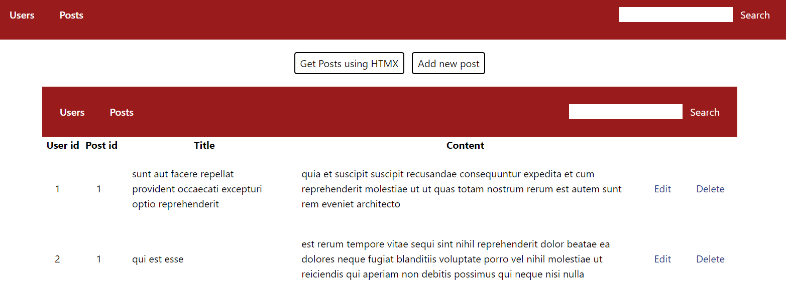
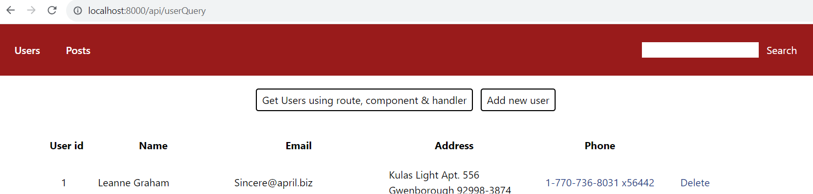
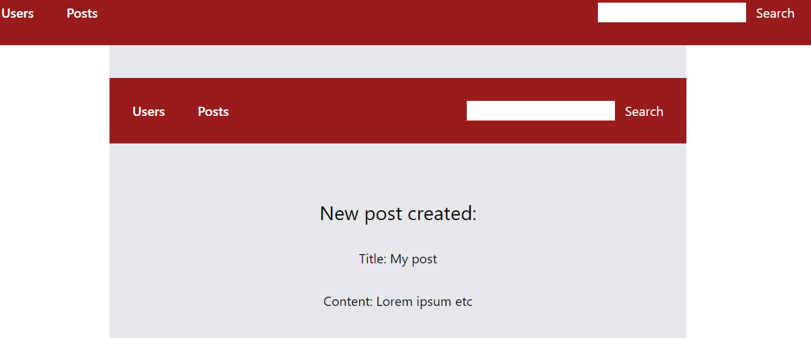

# Deno Fresh & Deno Fresh with HTMX

 

## Description

Study of HTMX usage using JSON Placeholder api.

## Notes

Currently contains get posts & users, and post new post & post new user.

### Fetch posts

Fetches posts by calling a route in the app with htmx. The route contains a
function that fetches data from the api and returns it formatted in jsx (tsx).
Instead of re-directing user to that route, the returning jsx is inserted in a
specified section in the original page.

The button to fire the htmx is an **island** rendered client side, since they premade `<Button>` component.

❗For some reason the method duplicates the NavBar component (inserted in
_app.tsx).

```jsx
<body>
  <NavBar></NavBar>
  <Component />
</body>;
```



### Fetch users

Fetches users with Fresh's method by linking the user to a route where a Get
handler fetches the data from the api and passes them onto the component.

The buttons contain `<a>` tags to redirect the user and are **components**
rendered server-side.

Usercontrols (buttons) component needs to be repeated on top of the page that
displays the data, as the user actually moves to a new location.



### Create a new post with **hx-post**

Route *posts/add* displays a form to create a new post.
On submit, hx fires api/addPostQuery route which receives post request in handler and renders component with the returned data

*posts/add:* Click create post (hx-post)  
⬇️  
*api/addPostRequest:* Handler POST method  
⬇️  
*api/addPostRequest:* JSON Placeholder API  
⬇️  
*api/addPostRequest:* Render.ctx in handler with returned data  
⬇️  
*api/addPostRequest:* return component with data in jsx  
⬇️   
*posts/add:* Replace form with returned JSX 

Inserting hx result again replicates the navbar in the middle of the component.



### Create a new user with Fresh route handler

Route *users/add* displays a form to create a new user.
On submit, 
`<form method="post">` sends a post request to **this same page's handler**, where data is sent to JSON Placeholder API, received and rendered back to the component. 

*users/add:* Click create user  
⬇️  
*users/add:* Handler on same route handles POST method and sends data to API.  
⬇️  
*users/add:* Render.ctx in handler renders component with the returned data from API.  
⬇️  
*users/add:* When Api-returned data is present in the component, information about the new user is rendered instead of the form.

With this method, all action happens in the same component, and on **server-side**.